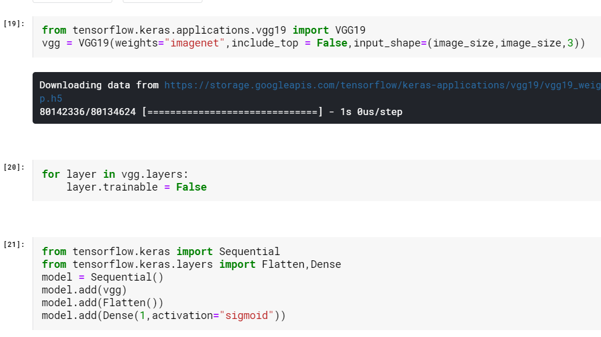
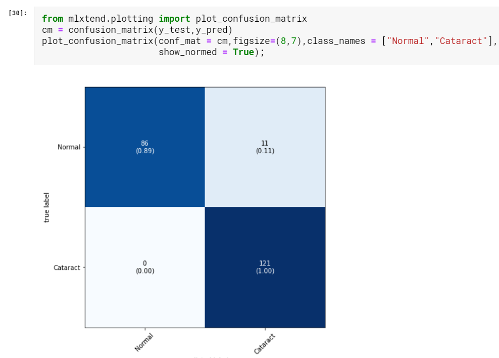
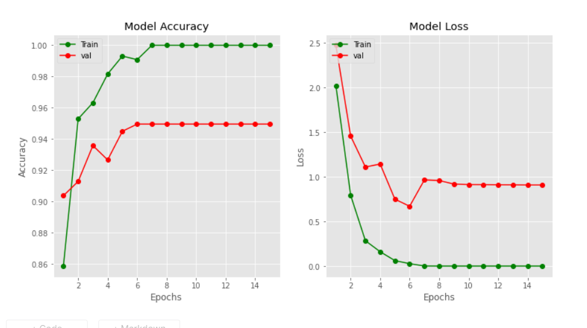
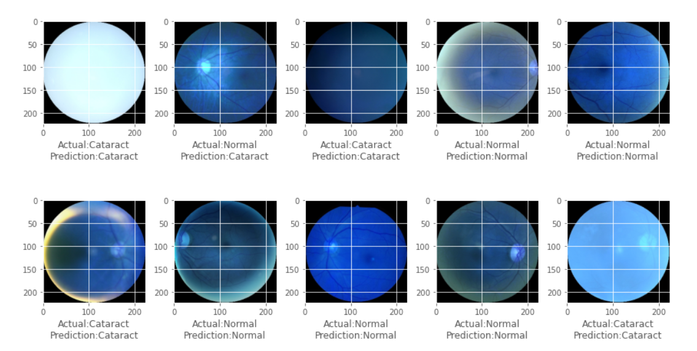

# Cataract-Detection-using-VGG-19
A deep learning model built to detect cataract in human eyes using the VGG19 pretrained weights.  
VGG-19 is a convolutional neural network that is 19 layers deep. You can load a pretrained version of the network trained on more than a million images from the ImageNet database. The pretrained network can classify images into 1000 object categories, such as keyboard, mouse, pencil, and many animals. As a result, the network has learned rich feature representations for a wide range of images. The network has an image input size of 224*224. VGG19 is a variant of VGG model which in short consists of 19 layers (16 convolution layers, 3 Fully connected layer, 5 MaxPool layers and 1 SoftMax layer). There are other variants of VGG like VGG11, VGG16 and others. VGG19 has 19.6 billion FLOPs.  

Libraries used :  
Numpy  
Pandas  
OpenCV  
Matplotlib  
Keras  
Tensorflow  

Dataset can be downloaded from this link & to be store inside "input" folder in main directory :  
https://www.kaggle.com/andrewmvd/ocular-disease-recognition-odir5k  

The output looks like : 

